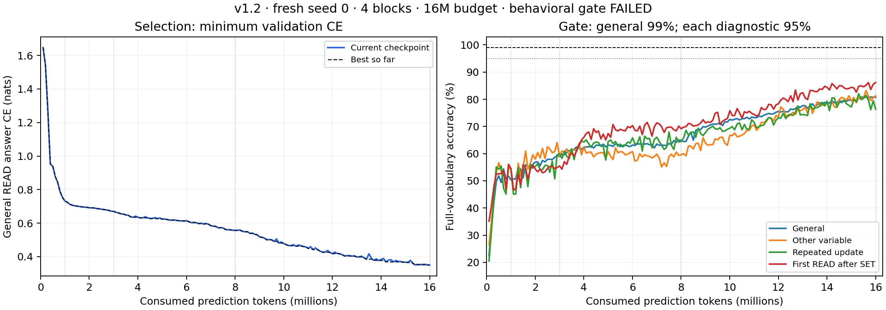

# v1.2 P3 중단 보고 — 16M 완주, 행동 gate 실패

2026-09-17. **실행·증빙 감사는 통과했고 행동 gate는 실패했다.** P2 CPU/GPU smoke는 통과했다. Seed 0을 16M까지 학습했지만 일반 ≥99%, 세 진단 각각 ≥95%에 미달했다. 설계에 따라 이 버전의 학습을 종료한다. P4 seed 1·2, SAE/TC 및 인과 분석을 시작하지 않으며 자동으로 예산을 늘리지 않는다.

## 선택과 행동 결과

전체 160회 validation 중 일반 READ 답 CE가 최소인 **update 2,160**을 선택했다. 마지막 checkpoint와 동일하다. 선택 후 CPU 재평가에서 모든 정확도·표본 수가 일치하고 답 CE 차이가 1e-5 nats 이내였다. Test 점수는 평가하지 않았다.

| Validation | 독립 sequences | READ targets | 답 CE | Full-vocabulary 정확도 | Gate |
|---|---:|---:|---:|---:|---:|
| 일반 | 512 | 8,171 | 0.349920 | **80.72%** | 99% 미달 |
| 다른 변수 읽기 | 512 | 512 | 0.339287 | **81.25%** | 95% 미달 |
| 복수 갱신 | 512 | 512 | 0.385745 | **76.37%** | 95% 미달 |
| 최신 SET/초기화 이후 첫 READ | 512 | 512 | 0.289345 | **86.13%** | 95% 미달 |

선택 checkpoint SHA-256: `3254c12495f996da79f47978fefb01456701b316a0e765704de3739944fa1317`.

일반 전체 next-token CE는 0.997014, B0/B1 제한 정확도는 80.72%, `P(B0)+P(B1)`는 99.9536%다. 대부분의 답 확률질량이 bit 토큰에 있지만 bit 값의 정확성이 부족하다. 일반 validation의 실제 기준선은 majority 50.68%, 독립 동전 기대값 50%, 최근 SET/초기화 값 64.45%, 직전 READ 답 복사 57.50%다. 나머지 split 기준선은 [보충 감사](./p3_supplemental_audit.json)에 저장했다.

## 3M에서 16M까지의 변화

| 명목 milestone | 실제 prediction tokens | Update | Current 답 CE | Best 답 CE | Current = best 정확도 | 다른 변수 / 복수 갱신 / 첫 READ |
|---|---:|---:|---:|---:|---:|---|
| 1M | 1,002,099 | 136 | 0.731813 | 0.731813 | 50.35% | 54.49% / 54.69% / 54.49% |
| 3M | 3,004,531 | 407 | 0.670175 | 0.670175 | 58.90% | 58.98% / 59.96% / 55.47% |
| 8M | 8,001,583 | 1,082 | 0.556758 | 0.556758 | 64.88% | 59.57% / 64.45% / 69.14% |
| 16M | 16,001,083 | 2,160 | 0.349920 | 0.349920 | 80.72% | 81.25% / 76.37% / 86.13% |

3M→16M 일반 정확도는 **21.82 percentage points 증가**, 답 CE는 **0.320255 nats 감소**했다. 네 milestone에서는 current와 best가 같고, 전체 곡선에서는 각각 별도로 기록했다. 마지막 네 CE는 0.353709 → 0.354658 → 0.351235 → 0.349920이다. 끝까지 개선 여지는 보이지만, 고정 16M 계약에는 이 관측으로 예산을 연장하는 규칙이 없다.



기존 v1.1과 첫 7개 train token shards가 byte-identical하고, seed 0 **초기 모델 및 update 407 모델의 모든 tensor가 bitwise 동일**하다. GPU 환경 ID와 microbatch도 같다. 따라서 같은 초기화·prefix에 추가 데이터를 소비한 비교다. 독립 seed 재현으로 세지 않는다. 선택 후보 수가 30회에서 160회로 늘었다는 점도 포함하며, 16M이 최적이거나 데이터 부족만이 실패 원인이라고 결론짓지 않는다.

일반 validation의 연산별 정확도는 SET 94.58%, NOT 74.68%, AND 77.89%, OR 81.03%, XOR 65.97%다. 답 0/1별 정확도는 72.80%/88.43%이고, 진리표 12칸 macro는 75.36%다. OR:00은 36.39%, XOR:00/11은 49.82%/52.48%로 취약하다. 이는 마지막 갱신 연산에 따라 나눈 validation 관측이며 실패 원인의 인과적 증거는 아니다. 모든 cell의 표본 수·macro·coverage는 [strata CSV](./p3_selected_strata.csv)에 보존했다.

## 실제 실행 및 증빙

- 4 blocks / 797,184 parameters, fresh seed 0, FP32, effective batch 64, microbatch 16. OOM 축소·재개 없음.
- **138,240 sequences / 16,001,083 prediction tokens / 2,160 updates**, overshoot 1,083, 다음 validation boundary 16,100,000.
- Init 1개 + validation checkpoint 160개 = **161개**와 optimizer/RNG/cursor/선택 이력/완료 index를 원본 ZIP에 보존했다. 완료 index에 등록된 모든 파일 checksum과 evaluation boundary, milestone current/best 참조를 검증했다.
- Tesla T4 15,637,086,208 bytes VRAM, Python 3.13.15 / torch 2.11.0+cu128 / CUDA 12.8 / cuDNN 91900. 환경 ID `e74fb1dcf8112ca0`.
- 첫 50 updates: 371,385 tokens / 5.337475초 = **69,580.65 tokens/s**, peak allocated VRAM 244,694,016 bytes. 이 peak는 첫 50 updates 측정값이다.
- 학습 update 시간 합 227.03초, validation 합 801.26초, 세션 총 1,158.42초(19.31분). 차이는 저장 등 세션 overhead이며 서로 합산해 중복 계상하지 않는다.
- Colab CPU/GPU smoke passed, Colab 구현 tests 8 passed. 반환 후 CPU tests **8 passed / 9.65초**, 전체 corpus 독립 replay·metadata·누출·quota 재검산 **163,735 sequences / 3,072 causal pairs**, 82.87초, passed. 데이터 검사에서 test 파일 무결성은 확인했으나 모델의 test 점수는 보지 않았다.
- CPU 재평가는 macOS torch 2.13.0을 사용했다. 이 환경의 fresh 생성 가중치는 Colab 초기화와 최대 4.47e-8 차이가 있어 cross-environment bitwise 재현을 주장하지 않는다. 과거/현재 Colab 초기화와 3M tensor 비교는 exact다.

## 실행 번들 출처 차이

반환된 결과는 `p3_16m_bundle_v1.zip`(SHA `f9117aaebecef1c1695d75ce831c3eeaaf22b44c04bb62f6d5cc00859f9daaa6`)로 실행됐다. 최종 전달 문서의 v2 실행으로 표기하지 않는다. v1 원본을 별도로 추출한 감사 root에서 입력 manifest 219개 항목 전체를 검증하고 원래 verifier를 실행했다.

실행 config hash는 `8503418e4705120a5eaa5f4cc948c628d61dfafc416ec791699f778b1b9479d9`, corpus manifest hash는 `5decfd2af5c77535c6410b8a716cb914f47d0a4f4c398915d7eacff19a449eee`다. v2와의 차이는 `.DS_Store` 제외, `cpu_validation.json`의 해당 참조 삭제 및 관련 manifest/config checksum 갱신이다. **166개 실제 데이터·증빙 leaf와 실행 Python 코드는 동일**함을 대조했다. 학습값·순서·평가·선택 계약은 같다. 원본 결과 hash를 현행 v2 hash로 바꾸지 않았다. 기존 `p1_release_validation.json`의 “discarded bundle”은 배포 정리 당시 기록이며, 이번 반환 결과가 그 번들로 실행됐음을 이 보고서가 추가 기록한다.

사용자 반환 원본 ZIP: `/Users/jangjiheon/Desktop/p3_16m_evidence_20260917T073251285323.zip`, 1,486,790,692 bytes, SHA `db16d7c4d9eabcae611fee58080865d37aaef9a6b1eb3b709db01a48f1bb6141`. 최초 checksum 검증·추출 후 원본이 iCloud dataless 상태가 되어 프로젝트로 복사가 멈췄다. macOS 다운로드 요청 후에도 대기해, 검증된 원본 구성원 2,522개를 `evidence/p3_16m_verified_contents_20260917.zip`으로 재압축하고 모든 파일의 roundtrip SHA-256을 대조했다. ZIP 컨테이너 hash는 달라지지만 구성원 바이트는 보존한다. 사용자 원본은 그대로 두었다. 재압축 기록·원본 및 새 hash·파일별 SHA는 `results/p3_repacked_archive.json`에 기록한다. 재압축 전체 증빙 ZIP과 실제 실행 입력 ZIP을 Git LFS로 보존한다. 편의용 JSON/환경 기록은 `evidence/p3_16m_20260917/`, 로컬 감사는 [run audit](./p3_run_audit.json), [supplemental audit](./p3_supplemental_audit.json), [corpus 재검산](./p3_cpu_corpus_reaudit.json)에 있다.

## 감사 재실행

두 ZIP을 각각 새 디렉터리 `executed_root`, `evidence_root`에 풀고 다음을 실행한다. 아래 경로는 실행자가 지정하는 placeholder다. 원본 실행기에 손대지 않고 실제 실행 입력을 사용해야 한다.

```sh
python executed_root/scripts/verify_p3_16m_evidence.py evidence_root/lm_seed_0 --output evidence_root/local_run_audit.json --reevaluate --device cpu
python scripts/audit_p3_16m_return.py --executed-root executed_root --release-root . --evidence evidence_root --output new_audit_output
python scripts/plot_p3_16m_results.py
```

로컬 최초 보충 감사에서 배포 전후 `cpu_validation.json`까지 byte-identical하게 비교한 조건이 실패했다. 실제 diff가 `.DS_Store` 참조 삭제뿐임을 확인하고 별도로 검증하도록 감사 코드를 수정했다. 이어 macOS/Colab fresh 초기화 bitwise 비교가 실패해 위 수치 차이를 기록하고, 규격에 맞게 동일 Colab 환경의 보존된 v1.1 init과 직접 비교했다. 이는 원본 학습 코드나 성공 기준의 변경이 아니다.
