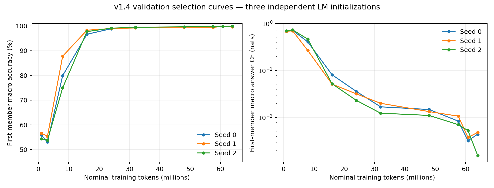

# v1.4 P4 seed 1·2 반환 감사 및 재현 결과

**결론: seed 0·1·2 모두 동결된 validation 행동 gate를 통과했다.** 새 두 seed의 반환 증빙 감사도 통과했다. 세 seed의 선택·gate·checkpoint hash를 `validation_freeze.json`에 동결했다. Frozen test는 아직 채점하지 않았으며 P4 전체 완료와 P5 진입은 아직 아니다.

| Seed | 선택 update | 일반 READ | 오류/16,593 | First macro | 오류/2,688 | Repeat macro | 오류/2,688 |
|---|---:|---:|---:|---:|---:|---:|---:|
| 0 | 7,983 | 99.9277% | 12 | 99.8140% | 5 | 100.0000% | 0 |
| 1 | 7,983 | 99.9217% | 13 | 99.8884% | 3 | 99.9628% | 1 |
| 2 | 8,399 | 99.9699% | 5 | 100.0000% | 0 | 100.0000% | 0 |

## 해석

세 seed 모두 실제 64,005,751 prediction tokens / 8,399 updates / cursor 537,536을 소비했다. 아키텍처·read4·optimizer·LR·train 순서·effective batch 64·microbatch 16은 동일하다. 같은 Tesla T4, PyTorch 2.11.0+cu128, 환경 ID `e74fb1dcf8112ca0`를 사용했다. seed 0 하나의 우연한 초기화에서만 성공한 결과는 아니며, 이번 세 초기화에서 행동 학습 성공이 재현됐다. 단, 세 모델은 같은 validation 표본을 평가했으므로 이를 독립 데이터 세 집합처럼 합산하지 않는다.

Seed 1은 60.8M milestone의 update 7,983, seed 2는 64M의 update 8,399가 사전 select CE 규칙으로 선택됐다. Seed 1의 마지막 checkpoint는 select first accuracy 99.6652% / CE 0.004900으로 선택 checkpoint의 99.8512% / CE 0.003784보다 낮았다. 마지막 checkpoint를 무조건 쓰지 않은 이유가 확인된다. Gate 점수로 재선택하지 않았다.

Select first 정확도는 8M에서 seed별 74.96–87.76%로 차이가 컸지만 16M에서 96.65–98.29%, 최종 선택에서 99.85–99.96%에 도달했다. 초기 학습 속도의 차이가 최종 행동 gate 실패로 이어지지는 않았다. 이것은 select 학습 곡선이며, 16M에서 독립 gate를 통과했다고 해석하지 않는다.

Gate first의 잔여 오류는 seed 0의 5개, seed 1의 3개 모두 depth 4+에 있다. Seed 1은 AND:11, NOT:1, OR:01의 depth 4+에서 각 1개 오류; repeat는 XOR:11/depth 2–3에서 1개 오류다. Seed 2는 first/repeat 각 2,688개에서 오류가 없었다. 모든 연산·depth·answer group과 42-cell quota/coverage가 충족됐으며 세 legacy 진단도 모두 95% 기준을 넘었다.

일반 READ의 majority 50.4851%, 최근 SET/초기화 복사 64.1536%, 최근 READ 답 복사 57.9521%보다 세 모델의 99.92–99.97%가 높다. 해당 단순 규칙들만으로 현재 점수를 설명하기는 어렵다. 그러나 내부 상태 표현이나 인과 메커니즘은 probe/SAE/TC/패칭으로 별도 검증해야 한다.

First macro의 기록된 1,000회 within-cell origin bootstrap 95% CI는 seed 0 [99.6280%, 99.9628%], seed 1 [99.7396%, 100%], seed 2 [100%, 100%]다. Seed 2의 퇴화 CI는 관측 표본의 오류가 0이어서 생긴 것이며 모집단 오류율이 0이라는 보장이 아니다. Seed 2를 test 결과 없이 우수 모델로 골라 나머지를 제외하지 않는다.

## 증빙 및 재개

- Seed 1: ZIP 8,450개 파일 checksum, init/모든 milestone/last, optimizer step·RNG·cursor·평가 경계, GPU smoke·lock·code/config/data, 전역 select 선택 및 one-time gate 기록 검증 통과. Session 1개, 최종 session 57.69분, 기록된 학습 연산 합계 50.43분.
- Seed 2: ZIP 8,453개 파일 checksum, init/모든 milestone/last, optimizer step·RNG·cursor·평가 경계, GPU smoke·lock·code/config/data, 전역 select 선택 및 one-time gate 기록 검증 통과. Session 2개, 최종 session 60.88분, 기록된 학습 연산 합계 53.43분.

Seed 2는 초기 init checkpoint에서 한 번 재개했다. 저장된 8,399개 update의 token/cursor는 중복 없이 일치했고 seed별 fresh 초기화는 반환된 Colab 동일 환경 검증에서 통과했다. 로컬 Mac/PyTorch 2.10 재생성은 Linux/PyTorch 2.11과 작은 FP32 차이가 있어 byte-identical하지 않았으며, 다른 환경에 한정한 atol=1e-7 / rtol=0 검사로 별도 검증했다. 최초 strict 실패 로그와 각 tensor digest·최대 차이를 보존했고 잘못된 seed·같은 환경 불일치 거부 검사를 추가했다. 첫 세션에서 완전 저장 이전에 수행했을 수 있는 연산 시간은 복구된 기록만으로 산정할 수 없다. 최종 세션 시간과 전체 사용 GPU 시간을 동일시하지 않는다. 두 seed의 최초 50 updates peak allocated memory는 약 0.906 GiB다.

원본 ZIP은 보존했고 감사 임시 추출물만 검증 후 제거했다. 기록된 GPU 실행 증빙을 로컬에서 감사했으며 GPU 본학습을 독립 재실행한 것은 아니다. Gate/test forward를 실행하지 않았다. 외부 checksum 파일이 없는 경우 ZIP 전체 SHA-256은 이 감사에서 계산했으며 내부 checksum 전체와 계약을 대조했다.

## 다음 단계

세 seed의 학습·선택·validation 결정을 동결했으므로 다음은 세 seed 전체에 대한 one-time frozen test다. Test는 추가 합격 gate가 아니고 checkpoint 재선택에 쓰지 않는다. 최종 test 반환을 검증한 뒤 P4를 완료하고 P5로 진행한다. 현재 최소 두 seed 통과 조건은 3/3으로 충족했지만, P4 완료 조건은 아직 남아 있다.

근거: seed별 `completion.json`, `run_verification.json`, `details_verification.json`, `gpu_smoke/verification.json`, `behavior_validation.csv`, `validation_freeze.json`.

